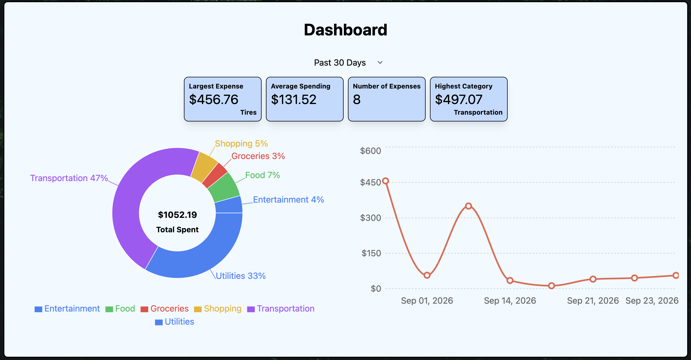
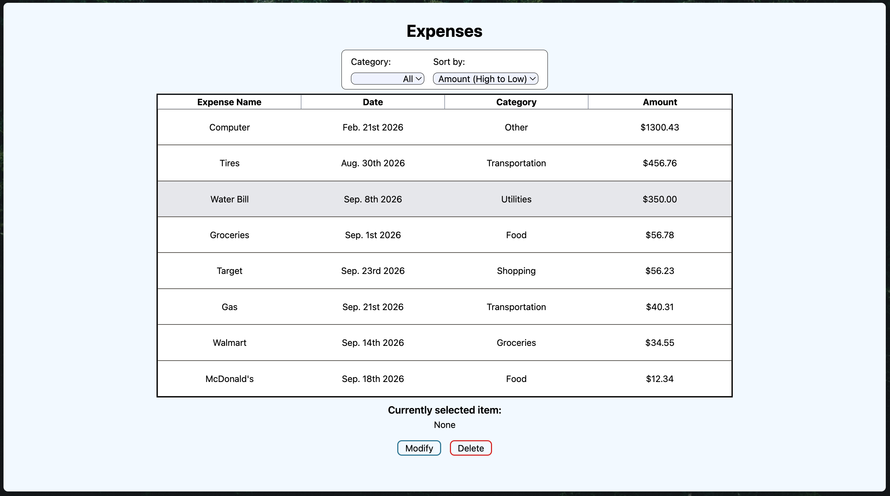
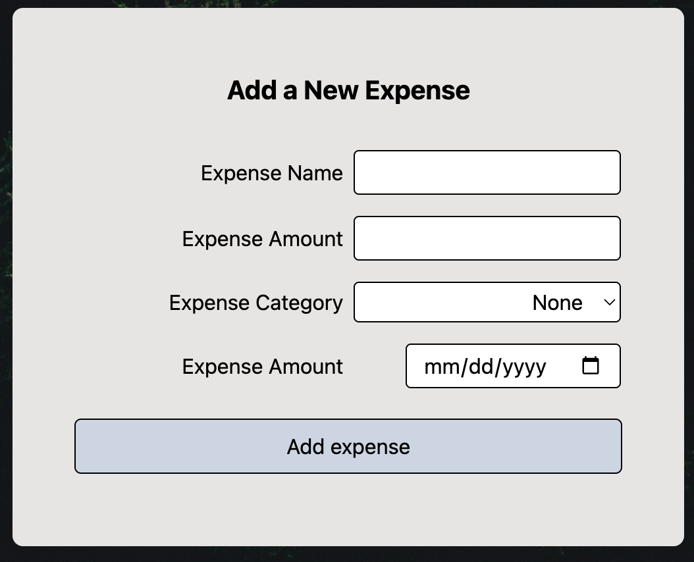

# Finance Tracker

A full stack application that allows users to manage expenses, organize spending, and visualize spending habits.

## Features

- Add expenses
- View expenses
- Modify expenses
- Delete expenses
- Categorize expenses
- Filter expenses by category
- Sort expenses by date, amount, and name
- View total spending
- View average spending
- View largest expense
- View spending statistics by category
- View monthly spending
- Visualize spending with charts

## Screenshots

### Dashboard

### Expense List

### Add Expenses

## Tech Stack
### Frontend
- React
- Vite
- Tailwind CSS
- Recharts

### Backend
- Express.js
- Node.js
- REST API

### Database
- PostgreSQL
